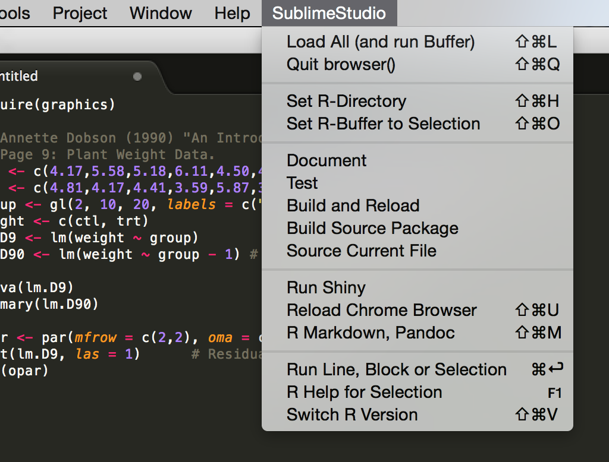

# RStudio Experience in a Real Editor

A Sublime Text plug-in that tries to bring parts of the user experience of
RStudio to Sublime Text. It is primarily designed to fulfill my personal  needs,
but you may find it useful as a template for your own customizations.
SublimeStudio has  borrowed heavily from
[R-Box](https://github.com/randy3k/R-Box) by randy3k (which is available
through package control).

## Features

- a prominent top level menu in SublimeStudio. You will love it (if R is your 
  main language), or hate it (otherwise).

- RStudio niceties: shiny, roxygen, load all, build and reload

- Support for different versions of R (or S-plus, or remote R sessions)

- An efficient debugging strategy

- Windows and Mac support 

## Installation

- Download the [zip folder](https://github.com/christophsax/SublimeStudio/archive/master.zip). Unzip.

- Move the `SublimeStudio` folder to your package directory (`Preferences > Browse Packages`).

- On Windows, adjust the path to your R installation(s) in 
  `SublimeStudio.sublime-settings`.

## The Sublime Studio Menu

All functions can be called from the SublimeStudio menu; the more frequent
ones also have a short-key:

## Debugging

For crazy R debugging, I find the following strategy the most useful:

1. Mark the command you want to investigate and save it in the SublimStudio 
   R-Buffer (by right click). It stays there until you re-assign the buffer.

2. Set a `browser()` somewhere in your function. 

3. Press `Ctrl/Cmd-Shift-L`: This saves the file, re-loads the package (using
   devtools) und runs the buffer line, so that R will halt were you set the 
   browser. (Make sure the option `browserNLdisabled` is set to `TRUE`; 
   otherwise new lines will quit the browser.)

4. After changing the code, press `Ctrl/Cmd-Shift-Q` to quit the browser and 
   `Ctrl/Cmd-Shift-L` to retry.

## Switching R Versions

This is useful if you are using different Versions of R. Occasionally, I also
use S-plus with SublimeStudio, which helps me forget that I use S-plus. I also
added a terminal option (on Mac) to  work directly on a Linux server.

## Credits

Randy3k, as mentioned. [Autohotkey](http://www.autohotkey.com), which is
included in the `bin` folder and used on Windows to transfer data from 
Sublime Text to R.

